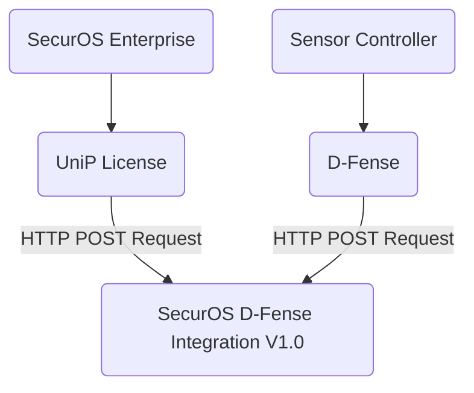

# SecurOS Enterprise - D-Fense Integration V1.0
### 1. Introduction

#### Purpose of the API

The SecurOS Enterprise - D-Fense Integration API allows you to seamlessly integrate SecurOS Enterprise 11.6 with D-Fense Command Control. This guide provides you with the necessary information to interact with the API, enabling you to exchange data and perform actions between these systems.

#### Key Features

-   Secure data exchange between SecurOS Enterprise and D-Fense Integration.
-   Real-time integration capabilities.
-   Detailed logging and error handling.

#### Terminology

-   **API**: Application Programming Interface
-   **Endpoint**: A specific URL that the API can receive requests at.
-   **Authentication**: The process of verifying the identity of a user or system.

### 2. Getting Started

#### Authentication

To access the API, you need to authenticate using Basic Authentication. The default credentials are as follows:

-   **Username:** iss
-   **Password:** iss

#### Making Your First API Request

To make your first API request, construct an HTTP request using the appropriate endpoint URL, set the necessary headers (including the "Authorization" header for Basic Authentication), and include the data you want to send in the request body. Refer to the API documentation for specific details.

```bash
POST /dfense HTTP/1.1
Host: 127.0.0.1:5000
Content-Type: application/json
Authorization: Basic dGVzdDp0ZXN0
Content-Length: 23

{
    "data": {}
}

```
### 3. API Endpoints

#### Endpoint 1: `/dfense`

This endpoint allows you to send data from D-Fense Integration to SecurOS Enterprise 11.6. 

### 4. Request and Response Format

#### Request Headers

-   `Authorization`: `Basic Authentication`.
-   `Content-Type`:  `application/json`

#### Request Body
//
#### Response Format

The POST response contains the following key components:

-   **data**: This section holds the specific data returned by the API. In this example, the "data" field contains contain the same value sent which represents the data received or processed by the API.
    
-   **status**: The "status" field indicates the status of the API response. In this case, the status is "Received," indicating that the API has successfully received and processed the request.
    
-   **date**: The "date" field provides a timestamp indicating when the response was generated. 

### 5. Troubleshooting

#### Common Issues and Solutions

When using the SecurOS Enterprise - D-Fense Integration V1.0 API, it's essential to be aware of common issues that may arise during API consumption. Below are some frequent challenges and their solutions:

##### Issue 1: Missing Content-Type Header

**Symptom**: You may encounter errors or unexpected behavior when making API requests if the `Content-Type` header is omitted.

**Solution**: Always ensure that you include the `Content-Type` header in your requests with the value "application/json" to specify the JSON format for the request body.


##### Issue 2: Missing Basic Authentication

**Symptom**: Forgetting to include Basic Authentication credentials in your API requests will result in authentication errors.

**Solution**: Remember to provide Basic Authentication credentials in the request's `Authorization` header. By default, the credentials are "test:test," encoded as "Basic dGVzdDp0ZXN0".


##### Issue 3: Incorrect Endpoint URL

**Symptom**: Sending requests to the wrong endpoint URL can lead to unexpected errors or incorrect data processing.

**Solution**: Double-check that you are using the correct endpoint URL for your specific API operation.

### 6. Connection scheme
